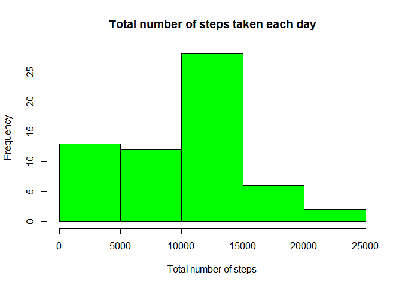
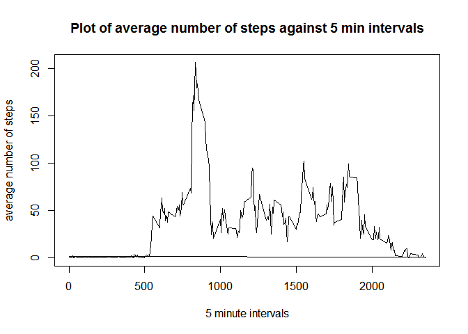
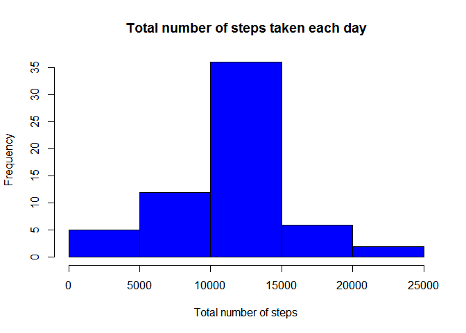
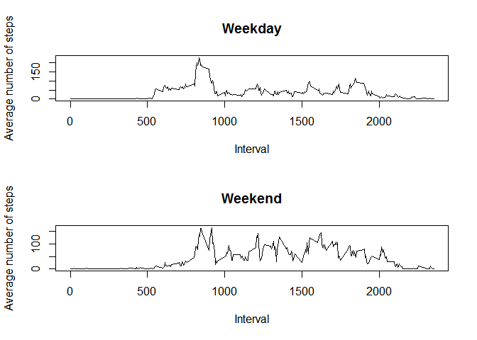

# Reproducible Research: Peer Assessment 1


## Loading and preprocessing the data


```r
##Loading the data

data <- read.csv("activity.csv")
data$steps <- as.numeric(data$steps)
data$date <- as.Date(data$date)
```

## What is mean total number of steps taken per day?


```r
##total number of steps in each day
totalsteps <- sapply(split(data$steps, data$date), sum, na.rm=TRUE)

## histogram of total number of steps in each day
hist(totalsteps, main = "Total number of steps taken each day", xlab = "Total number of steps", col="green")
```

 

```r
##mean and median total number of steps in a day
mean(totalsteps, na.rm=TRUE)
```

```
## [1] 9354.23
```

```r
median(totalsteps, na.rm=TRUE)
```

```
## [1] 10395
```


## What is the average daily activity pattern?


```r
##average number of steps taken in each interval across all days
data$avgsteps <- sapply(split(data$steps, data$interval), mean, na.rm=TRUE)

##time series plot of average number of steps against 5 min interval
plot(data$interval, data$avgsteps, type="l", main = "Plot of average number of steps against 5 min intervals", xlab = "5 minute intervals", ylab = "average number of steps")
```

 

```r
##finding and returning the 5 min interval with the max number of steps
x <- max(data[,4], na.rm=TRUE)
y <- match(x, data[,4])
z <- data[y,3]
print(z)
```

```
## [1] 835
```

## Imputing missing values

The strategy to fill in missing values is simple. I choose to use the mean number of steps for that 5 minute interval in which there is a missing value.The reason is simple as I assume that the individual's daily activity pattern is similar on average, so at certain times of the day he might move more than other times of the day. 


```r
##total number of missing values in dataset
sum(is.na(data$steps))
```

```
## [1] 2304
```

```r
##inputting missing values into a new dataset
df <- data
missing <- which(is.na(df$steps), arr.ind=TRUE)
df$steps[missing] <- df$avgsteps[missing]

##finding total number of steps in each day after inputting missing values
totalstep <- sapply(split(df$steps, df$date), sum, na.rm=TRUE)

## histogram of total number of steps in each day using modified dataset
hist(totalstep, main = "Total number of steps taken each day", xlab = "Total number of steps", col="blue")
```

 

```r
##mean and median total number of steps in a day using modified dataset 
mean(totalstep, na.rm=TRUE)
```

```
## [1] 10766.19
```

```r
median(totalstep, na.rm=TRUE)
```

```
## [1] 10766.19
```

## Are there differences in activity patterns between weekdays and weekends?


```r
##creating a factor variable to distinguish between weekday and weekend
df$day <- weekdays(df$date)
df$day <- factor(df$day, levels = c("Monday", "Tuesday", "Wednesday", "Thursday", "Friday", "Saturday", "Sunday"), labels = c("weekday", "weekday", "weekday", "weekday", "weekday", "weekend", "weekend"))
```

```
## Warning in `levels<-`(`*tmp*`, value = if (nl == nL) as.character(labels)
## else paste0(labels, : duplicated levels in factors are deprecated
```

```r
##creating new datasets for average number of steps for each interval across all weekdays or weekends
library(plyr)
dat <- ddply(df, c("day", "interval"), numcolwise(mean))
```

```
## Warning in `levels<-`(`*tmp*`, value = if (nl == nL) as.character(labels)
## else paste0(labels, : duplicated levels in factors are deprecated
```

```r
weekday <- dat[1:288,2:3]
weekend <- dat[289:576, 2:3]
```


```r
##making a panel (time series) plot
par(mfrow=c(2,1))
plot(weekday$interval, weekday$steps, type="l", xlab="Interval", ylab="Average number of steps", main="Weekday")
plot(weekend$interval, weekend$steps, type="l", xlab="Interval", ylab="Average number of steps", main="Weekend")
```

 

##Broadly speaking, there seem to be more steps taken on the weekends during the day (ie from 1000 to 2000).
